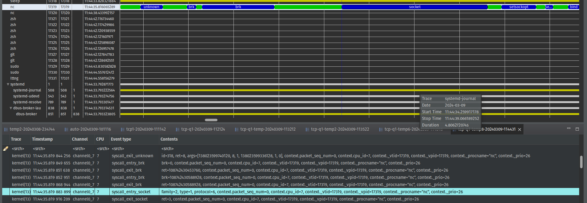
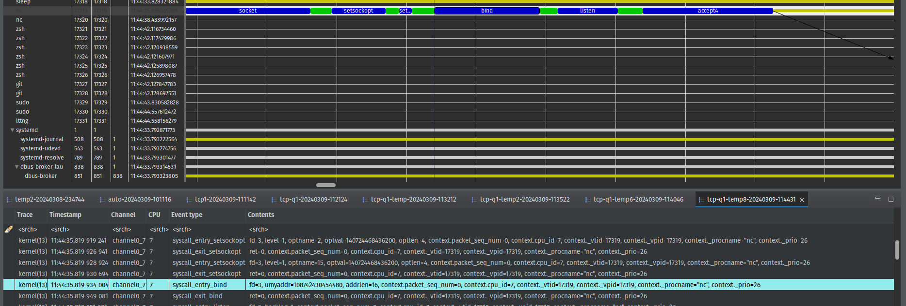
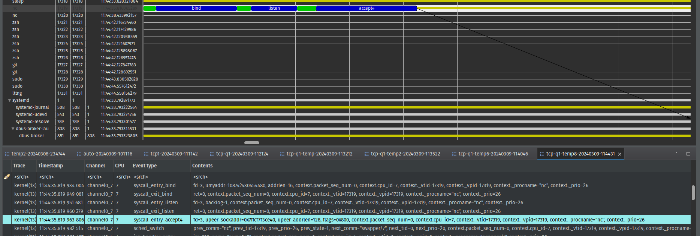
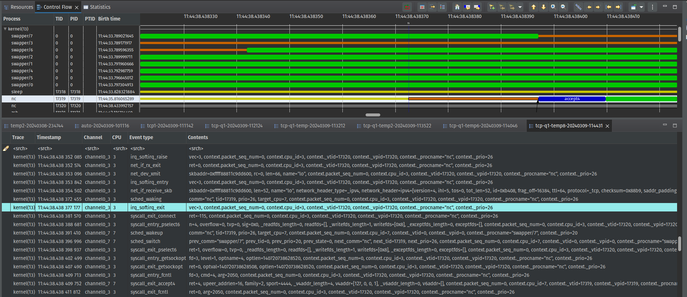
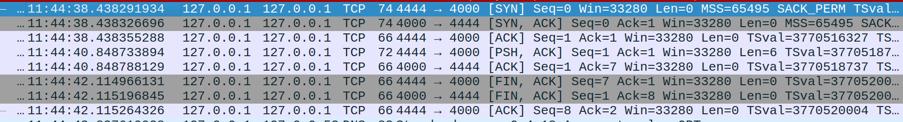
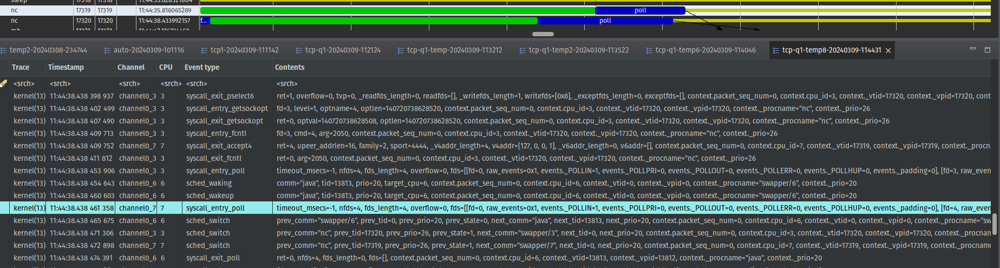
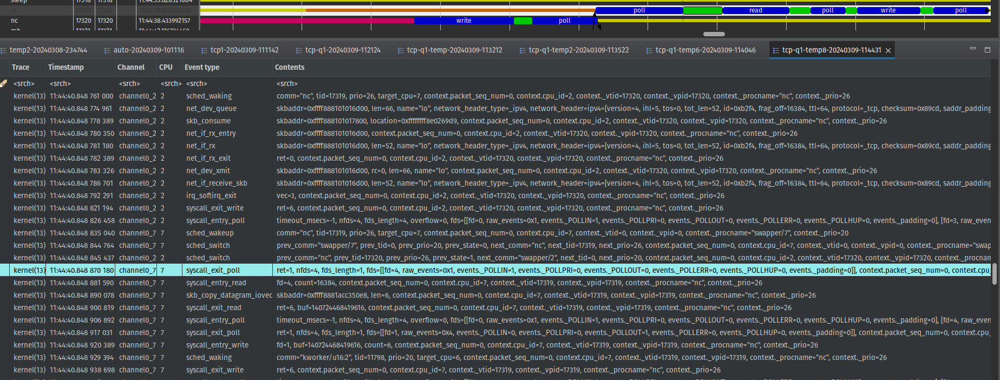
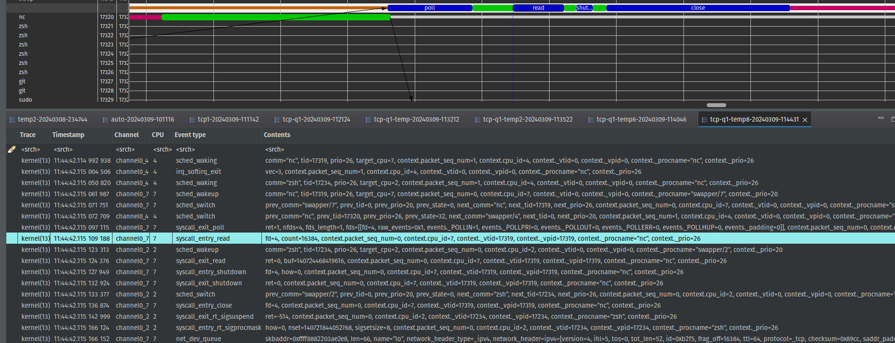
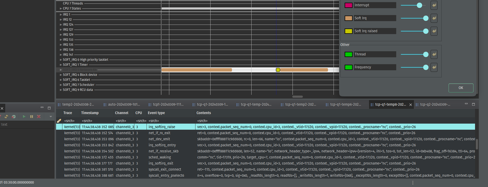

### Description 
In this question we are going to take a quick look over the journey that a TCP packet goes through. We mainly focus on the kernel events that are called whenever a TCP packet arrives in. The tools that we are going to use are as below : 
- ***ncat***
	- this program is used for the simulation of a real TCP connection 
- ***lttng***
	- lttng is the main tool used in this assignment which is responsible for collecting the kernel events. Additionally, we also utilized this tool to trace different system calls that are called while the packet is being transmitted between the network protocol stack layers.
- ***TraceCompass***
	- This tool is used to visualize the lttng tracing output files (which are in binary format) and display them in a human-friendly format so we can interact with them conveniently.
### Proposed solution
At first we need to establish a TCP connection :
- server side
``` bash
nc -l 127.0.0.1 4000
```
- client side
``` bash
nc -p 4444 127.0.0.1 4000
```
Afterward, we have to start lttng to do the tracing for us. For this purpose, we use the following bash script to trigger desired trace points :
``` bash
#!/bin/bash
sudo lttng create $1
sudo lttng enable-event -k --syscall --all
sudo lttng enable-event -k sched_switch,sched_wak'*',irq_'*',net_'*',skb_'*'
sudo lttng enable-event -k lttng_statedump_'*'
sudo lttng add-context -k -t vtid -t vpid -t procname -t prio
sudo lttng start
sleep 10
sudo lttng stop
sudo lttng destroy
```
### Tracing analysis
When the ncat server is executed, a bunch of system calls are called to service the ncat thread.  Some of them are related to the initial execution of ncat by gnome-terminal, analysis of these system calls is not the main purpose of this assignment, therefore we start our analysis right when the socket system call is called.
- At the beginning of the process, the **socket** system call is called. This system call basically requests for a socket to be created. The type of created socket can be identified by a family field in event parameters. 
	
	As we see the type of the created socket for nc thread is **2** which stands for an **ipv4 socket** (as expected). Additionally, the socket system call exits (**syscall_exit_socket** kernel event) with return value of 3 which corresponds to the file descriptor dedicated to this socket (according to socket system call manual page, the return value refers to the corresponding file descriptor)
- next the **bind** system call is called. This system call binds the socket created in the previous step to a certain network interface by using the file descriptor value dedicated to the socket. 
	
- Next up we have **listen** system call which listens on the created socket for any TCP connection establishment signals which basically means waiting for any TCP syn packets arriving at the socket 
- In this stage we get to one of the most important system calls in packet journey which is **accpet4**. This system call extracts the first TCP connection out of pending TCP connections in the listening socket. Based on two following pictures, we can realize interesting facts:
	
	as we see the syscall_entry_accept4 event is executed which means that ncat server is ready to accept any TCP connection. moreover we see that after a short time from initial execution of accept4, the thread status changes into wait_blocked (yellow color in tracecompass stands for CPU wait_blocked status) that is because no syn packet has yet arrived. So lets discover what will happen when a syn packet arrives at socket :
	
	As we see at some point the state of the thread is changed into ***waiting for CPU*** (at 11:44:38.438277177), this is when the syn packet arrives at socket. after the waiting ends the accpet4 keeps executing the exiting routing. As we see in exiting routing of accept4 (syscall_exit_accpet4) there is a value called **ret** which is the return value of accpet4. The ret value is the file descriptor value which corresponds to the data socket that the client and server are going to use for communication purposes in future. Moreover there are other interesting fields in syscall_exit_accept4 entry like v4addr that refers to source ip address of the syn packet and sport that refers to source port of the syn packet. For thorough understanding of the syn arrival time we provide the wireshark capturing flow of following scenario :
	
	Based on captured packets we can see that our observation around the arrival times are pretty close (11:44:38.438291934 by wireshark).
- Finally, the ncat thread starts executing the ***poll*** system call which waits for some event on a file descriptor. This system call is similar to **select** system call with minor differences. According to the scenario, the ncat server must wait for two different packets, a hello message sent by client and a TCP fin packet which is sent by client as a result of pressing ctrl+c for the end of connection. Let's observe what we discussed in details :
	
	As we see here, first poll routine starts executing by waiting on file descriptor 0 (stdin) and 4 (data socket). As there was not anything available on the socket to be consumed for a while, the thread enters the wait_blocked mode.
	
	Now we see that something has arrived at data socket. Let's find out what the actual arriving packet is; If we look at the syscall_exit_poll event, we will find that the packet has arrived from file descriptor 4 which is the data socket and means that something has been sent from the client side (probably the hello message written by client). To ensure what the payload of arrived packet is we can look at syscall_exit_read event; As we see the ret value in this event is 6 which according to the man page of read system call refers to the number of read bytes (total number of bytes in hello + enter)
	Another interesting thing about this tracing is the utilization of write system call in this thread. What is this write system call doing here ? 
	Well, it comes back to the nature of ncat server itself. When the server receives something from the client, it echos the message back to the standard output as well. So that is why we see write system call in this list.
	If we also observe the syscall_entry_write we find out that fd 1 is selected, that means the buffer is going to be dumped into standard output. Therefore by observation of syscall_exit_write we find that ret value is 6 which clarifies that the "hello" is written on standard output.
	Finally, the thread backs to polling mode until some packets arrive at data socket or the standard input.
- The final step is to observe the shutting down process. According to the following image :
	
	The process is explained in this way: first, the thread asks for CPU when it receives the FIN packet by client. Afterward, it executes the poll and then read system calls to read the content of the packet. To ensure that the packet was actually the FIN packet we can look at the fds value in syscall_exit_poll event (which is 4 and means that the packet arrived at data socket from client)and the ret value in syscall_exit_read (which is 0 and means there is no payload for the packet so it is definitely a control packet as TCP FIN is). As a result of receiving FIN packet the server shutdowns the connection and also closes the data socket by calling shutdown and close system calls. 
	One more thing to mention is the arrival time of FIN packet. According to sched_waking event (first event in above picture) the arrival time of FIN packet is **11:44:42.114992938**. We can compare this time to the time which is FIN packet is captured by wireshark.   
	
	As we see the arrival time of FIN packet is **11:44:42.114966131** which is pretty close to the time that we captured according to sched_waking event and clarifies the fact that the packet was actually the FIN packet.
#### Interrupts analysis 
in this section, we cover two common moments that the interrupt is triggered :
1. accepting new tcp connection (accept4 syscall)
2. polling until a packet arrives at data socket
	in below we explain the events related to first scenario :
	
	- net_if_rx_exit  probably checks if any packets available at driver card to collect or not
	- net_dev_xmit transmits the packet to upper layer. skbaddr also refers to the memory location of packet which in this case is syn packet
	- net_if_receive_skb handles the packet in network layer