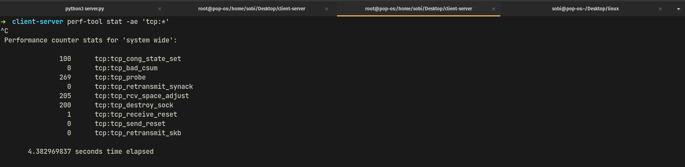
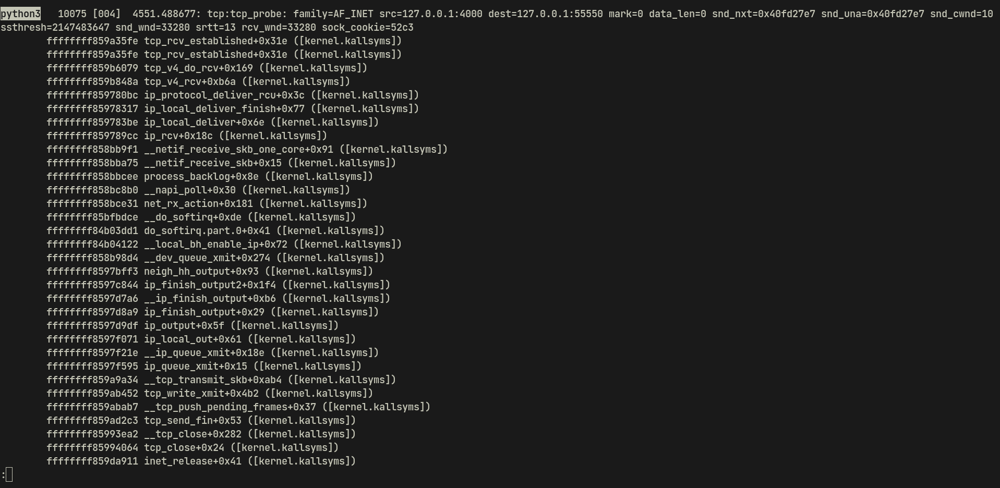

# This document explains how TCP handles a syn request
### Proposed solution
The solution to this problem consists of these steps :
- first we have to establish multiple tcp connections to a same server
- Then we have to track the counter of different events that are being called during the process
- Afterwards we have to filter the most subsequent events in our tracing
- Finally we have to observe the stack of those events to realize about the corresponding kernel functions
### Simulation of solution
#### Client application
```python
import socket
def establish_connection(server_address):
    client_socket = socket.socket(socket.AF_INET, socket.SOCK_STREAM)
    client_socket.connect(server_address)
    return client_socket

server_address = ('localhost', 4000) 
for i in range(200):
    try:
        client_socket = establish_connection(server_address)
        print(f"Connection {i+1} established.")
    except Exception as e:
        print(f"Failed to establish connection {i+1}: {e}")
client_socket.close()
```
This python code establishes 100 tcp connection with a same server. The server implementation is as below :
```python
import socket
server_socket = socket.socket(socket.AF_INET, socket.SOCK_STREAM)
server_address = ('localhost', 4000) 
server_socket.bind(server_address)
server_socket.listen(200) 
print("Server is listening on", server_address)
while True:
    connection, client_address = server_socket.accept()
    print("Connection received from", client_address)
```
### Finding subsequently called events
At the first step we are running the following command to trace tcp tracepoint events :
```bash
sudo perf stat -ae 'tcp:*'
```
We run the server and client apps afterwards. the result of tracing events is as below :

As we see the event which is noted subsequently is tcp:tcp_probe, so in the next state would be observing the call graph on this tracepoint
### Call Graph
The command for extracting the call graph of this specific tracepoint event is as below :
```bash
sudo perf record -ae 'tcp:tcp_probe' --call-graph dwarf
```
Here is the result of observing the call graph on tcp:tcp_probe tracepoint event

based on the call graph result we see that two functions tcp_v4_rcv and tcp_v4_do_rcv are noted subsequently. So lets explain this functions thoroughly.
#### tcp_v4_rcv
It handles the reception and initial processing of incoming TCP segments on IPv4 sockets. here are some interesting operations that this function takes care of : 
- When an IPv4 packet containing a TCP segment arrives, the networking stack passes it to the TCP layer. tcp_v4_rcv() is the entry point within the TCP layer for processing incoming TCP segments.
- first verifies the TCP checksum to ensure the integrity of the received segment. If the checksum is invalid, the segment is typically discarded to prevent potential data corruption.
The code for this function is located at  ***/net/ipv4/tcp_ipv4.c*** 
here is an overview of this function :
```c
int tcp_v4_rcv(struct sk_buff *skb)
{
// .... first part of the code here
process:
if (sk->sk_state == TCP_TIME_WAIT)
goto do_time_wait;
if (sk->sk_state == TCP_NEW_SYN_RECV) {
struct request_sock *req = inet_reqsk(sk);
bool req_stolen = false;
struct sock *nsk;
sk = req->rsk_listener;
if (!xfrm4_policy_check(sk, XFRM_POLICY_IN, skb))
drop_reason = SKB_DROP_REASON_XFRM_POLICY;
else
drop_reason = tcp_inbound_hash(sk, req, skb,
&iph->saddr, &iph->daddr,
AF_INET, dif, sdif);

//rest of the code here ....
}
```
As we see there are some signs of handling TCP_SYN packet in this function
#### TCP_V4_DO_RCV
The `tcp_v4_do_rcv()` function is a core component of the TCP/IP stack in the Linux kernel, responsible for processing incoming TCP segments on IPv4 sockets. It handles various tasks related to segment reception, connection management, and data processing. Here's an overview of what `tcp_v4_do_rcv()` typically does:
- The function verifies the TCP checksum to ensure the integrity of the received segment. If the checksum is invalid, the segment is typically discarded.
- If the segment contains data payload, `tcp_v4_do_rcv()` delivers the data to the receiving application, typically by placing it into the receive buffer associated with the TCP connection.
- The function handles various error conditions, such as out-of-order segments, duplicate segments, or invalid TCP header options.
the location of this function at linux kernel tree is : ***/net/ipv4/tcp_ipv4.c***

> [!NOTE] NOTE
> In the Linux kernel's TCP/IP stack, `tcp_v4_do_rcv()` and `tcp_v4_rcv()` are both functions involved in processing incoming TCP segments on IPv4 sockets, but they serve different purposes and operate at different levels of abstraction within the networking stack.
> - `tcp_v4_rcv()`: This function is primarily responsible for handling the initial reception and basic processing of TCP segments on IPv4 sockets. It deals with tasks such as segment verification, connection lookup, and initial state handling.
> -  `tcp_v4_do_rcv()`: This function is responsible for the comprehensive processing of TCP segments on IPv4 sockets. It performs more advanced processing, including state machine handling, flow control, data delivery to the application, and error handling.
#### tcp_rcv_established
`tcp_rcv_established()` is a function responsible for processing incoming TCP segments on an established TCP connection. This function is called when the TCP connection is in the ESTABLISHED state, indicating that data transfer between the sender and receiver is ongoing.
Some of the tasks that this function typically do are as below :
- `tcp_rcv_established()` verifies the sequence number of the received segment to ensure that it is within the expected range. Out-of-order segments may be buffered for reordering if necessary
- The function processes the acknowledgment number (ACK) in the TCP segment to determine which data has been successfully received by the remote endpoint.

To recap, three aforementioned functions are the main functions that kernel uses to handle a TCP connection establishment process. and the integrity of our findings also matches with the tracing results with `perf` tracing tool.